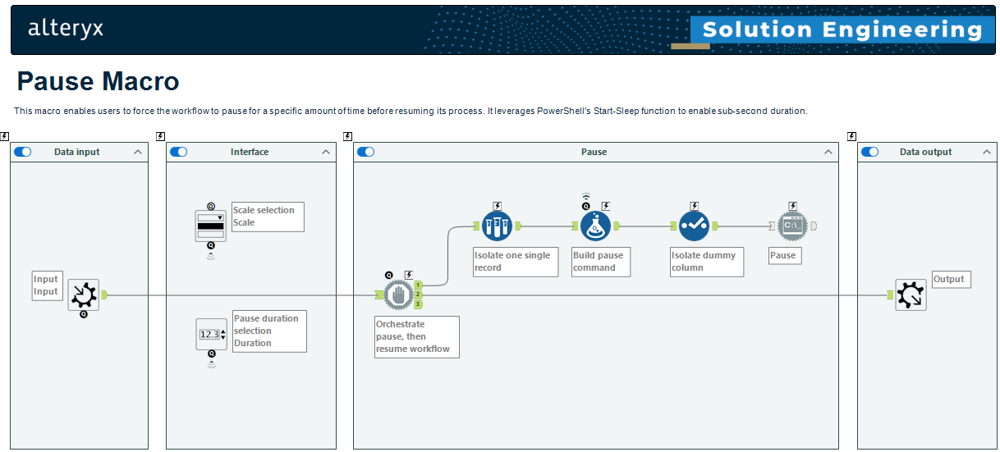
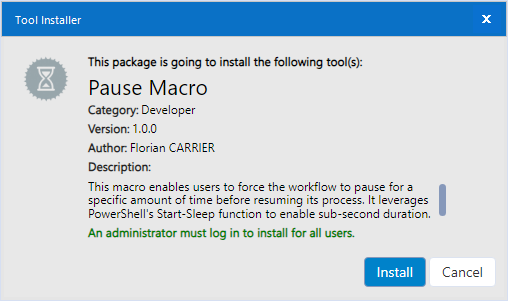
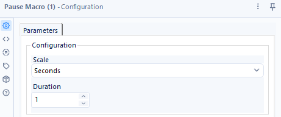
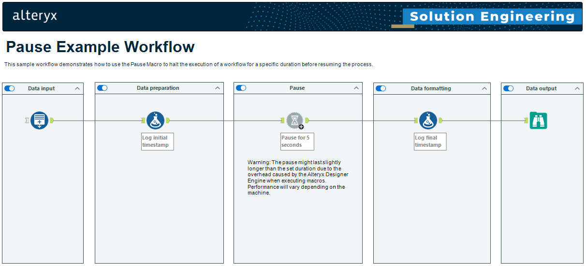

# Alteryx Pause Macro

The repository provides a macro for [Alteryx Designer Desktop](https://www.alteryx.com/products/alteryx-designer) to enable users to introduce a pause or delay in their Alteryx workflows. This can be useful for various purposes, such as waiting for external processes to complete or managing API rate limits.

## Installation

A standard Alteryx Tool Installer (.YXI) file is provided. Upon executing the installer, the macro will be setup on the local machine and made available in Alteryx Designer Desktop under the "Developer" tool category.

## Usage

### Configuration

The macro requires a single input which will pass through without being transformation.

Two configuration parameters are required:

1. Scale: The scale of the pause duration. Four options are available through a drop-down menu:
   1. Milliseconds
   2. Seconds
   3. Minutes
   4. Hours
2. Duration: The duration of the pause, specified as an integer value.

### Example

Upon installation, an example workflow will be made available in Alteryx Designer Desktop under `Help > Sample Workflows > Macros > Pause Example Workflow`.

## Dependencies

### Run Command Tool

The Alteryx Move Item Macro utilises the [Run Command Tool](https://help.alteryx.com/current/designer/run-command-tool). The Run Command Tool is included with Alteryx Designer Desktop by default, but can be disabled for execution when enabling [safe mode](https://help.alteryx.com/current/en/server/administer-alteryx-server/workflows--admin-interface/safe-and-semi-safe-run-modes--blocked-tools,-events,-and-data-connectors) on Alteryx Server.

### PowerShell

The Alteryx Move Item Macro utilises [PowerShell's Start-Sleep function](https://learn.microsoft.com/en-us/powershell/module/microsoft.powershell.utility/start-sleep?view=powershell-5.1) to halt the process. Therefore, PowerShell must be installed on the machine executing the macro, but this requirement should be satisfied by default on modern Windows operating systems.

> [Windows PowerShell 5.1 is installed by default on Windows Server version 2016 and higher and Windows client version 10 and higher.](https://learn.microsoft.com/en-us/powershell/module/microsoft.powershell.core/about/about_windows_powershell_5.1)

### PSAYX PowerShell module

In order to build the Alteryx Installer (.YXI) using the provided [Build-YXI](.\Build-YXI.ps1) PowerShell script, the [PSAYX PowerShell module](https://www.powershellgallery.com/packages/PSAYX) is required.
